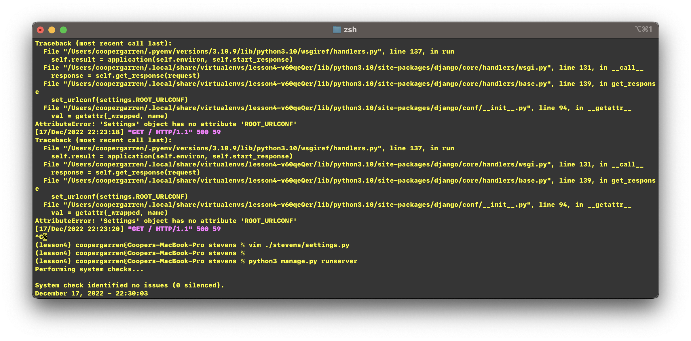
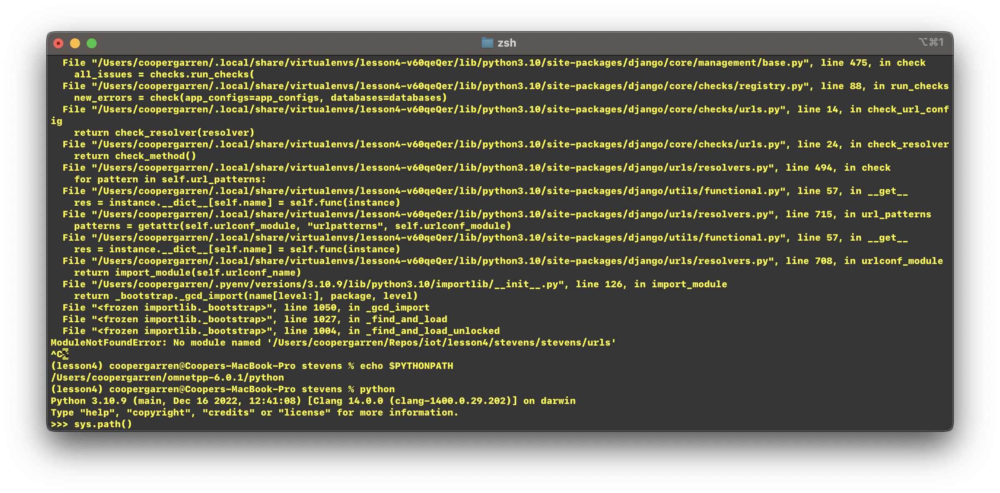
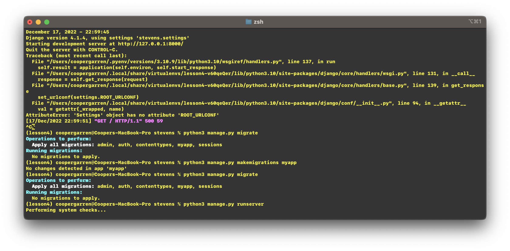
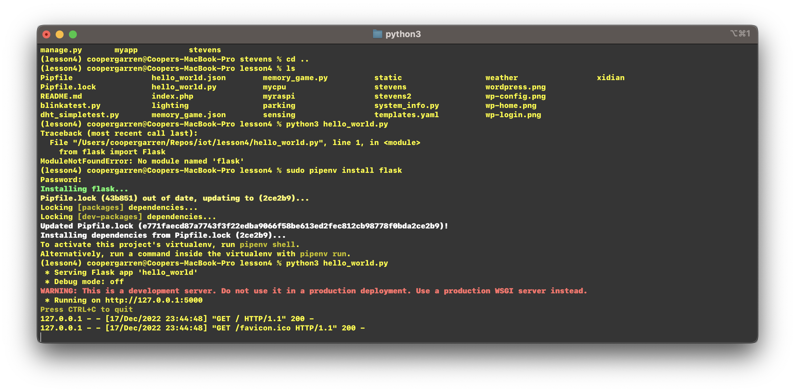
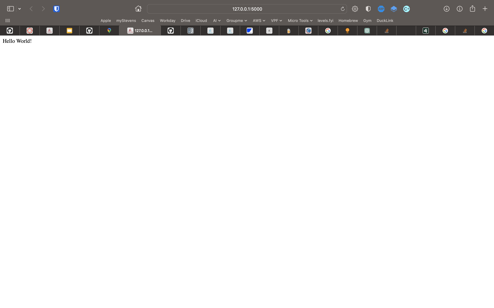

I couldn't get the stevens or mycpu projects in this lab to work on my machine. I spent several hours troubleshooting various errors all centered around improper Django configuration, but I eventually gave up. See below for screenshots of the errors I was getting and the hello_world.py flask app up and running.

